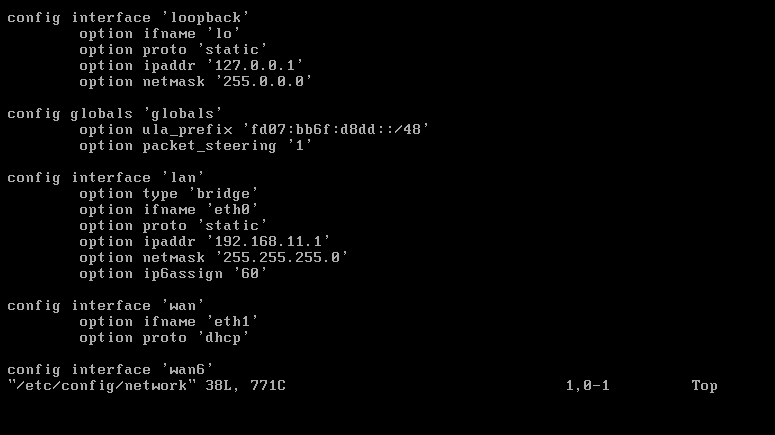
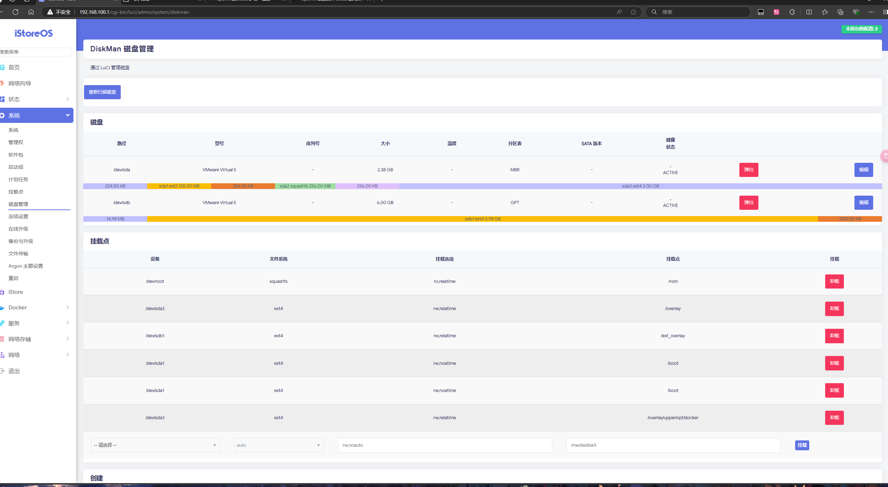
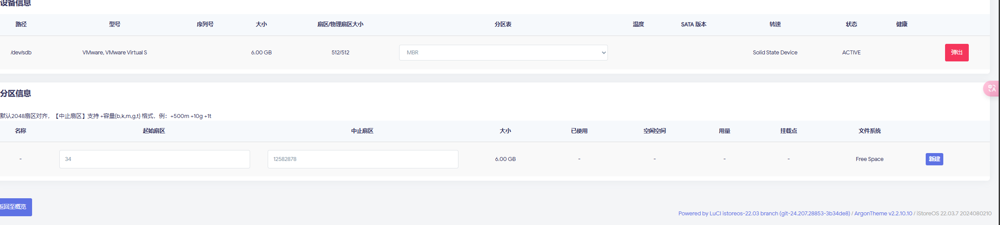
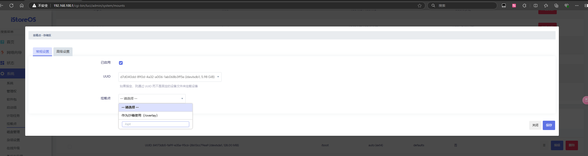
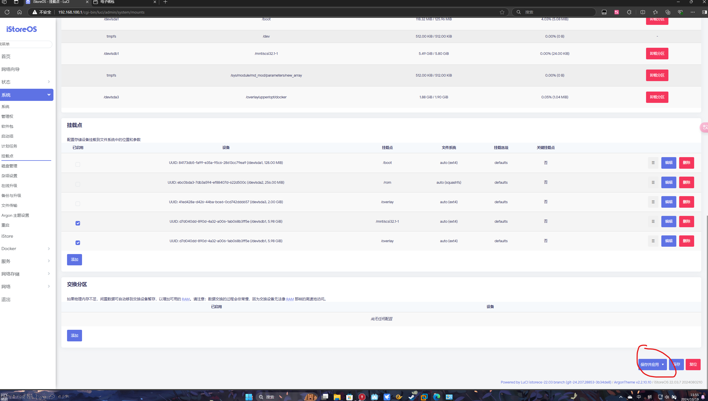
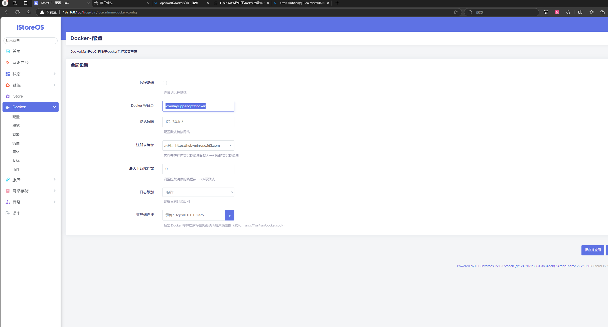
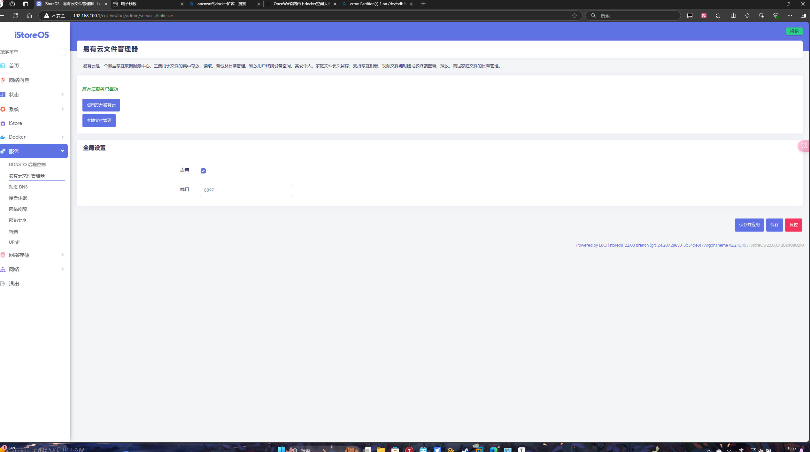
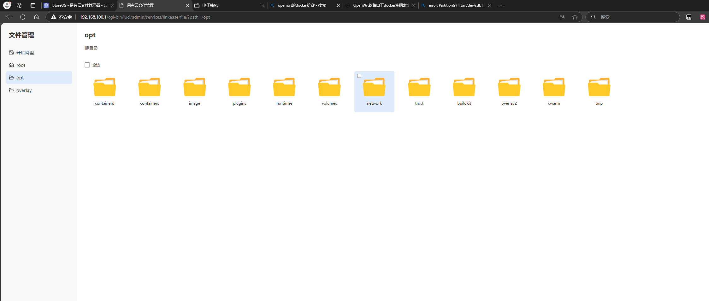

openwrt有三种方式安装，以下介绍安装方式

一、使用虚拟机安装x86固件

以下介绍虚拟机vmware

1、打开以下界面并点击编辑

2、弹出以下画面点击虚拟网络编辑器

3、

4、添加两次网络一个是VMnet0一个是VMnet1

5、VMnet0桥接电脑网卡

6、VMnet1按图示勾选（仅电脑可以联网，如果想把电脑当做中转连接其他设备要双网卡，可以把此链接改为桥接你连接设备的网卡，但是这样你电脑会没网络，你可以再添加一个vmnet设置好openwrt进行连接本电脑网络，但是这是你自己的事情了）

7、安装虚拟机系统

这里提供[DHDAXCW (骷髅头)]([DHDAXCW/OpenWRT_x86_x64: 基于 lede 源码建构 x86 的 OpenWrt 固件。 (github.com)](https://github.com/DHDAXCW/OpenWRT_x86_x64))固件下载，下载完成后再去下载以下软件把固件的.img格式转换成.vmdk格式

选择第二个

然后选择刚刚下载文件

然后一直点next

最后出现Finish转译的文件就在刚刚下载目录那里了

8、创建虚拟机

![].\assets\屏幕截图 2024-10-17 125127.png)

选择刚刚转译好的固件

保持现有格式

选择自定义硬件

添加两个网络适配器

网络适配器1

适配器2

关闭完成创建

9、右键创建的虚拟机，点击设置然后添加一个6g的硬盘：

然后就可以让虚拟机开机运行

等代码跑完之后再点进去虚拟机输入回车出现以下画面

10、输入vi /etc/config/netword

​      (记住vi后加空格再加/)

出现以下画面

11、点击i进入编辑模式

把configinterface ‘lan’下的option ifname ’eth0’改成option ifname ’eth1‘

把configinterface ‘wan’option ifname ’eth1’改成option ifname ’eth0

记住configinterface ‘lan’下的option ‘static’后面的ip是软路由后台ip地址192.168.11.1

12、然后按esc退出编辑模式，再按住shift加任意字母，然后再输入wq后回车再重启软路由

打开浏览器输入192.168.11.1

密码password

13、扩容docker

打开磁盘管理选择那个6g的硬盘点击编辑

点击新建，完了之后用ext4格式化

打开挂载点点击添加

按照图片填写保存

点击保存然后重启

打开docker更换根目录填写/opt然后保存

点击本地文件管理

打开opt根目录拖动镜像文件放进tmp文件里面

14、然后按照本项目的步骤执行

因为文件在opt根目录

要输入

`cd /opt`

进入根目录

然后执行命令

输入

`docker load -i /tmp/dialer.tar`

接下来按项目步骤就行
