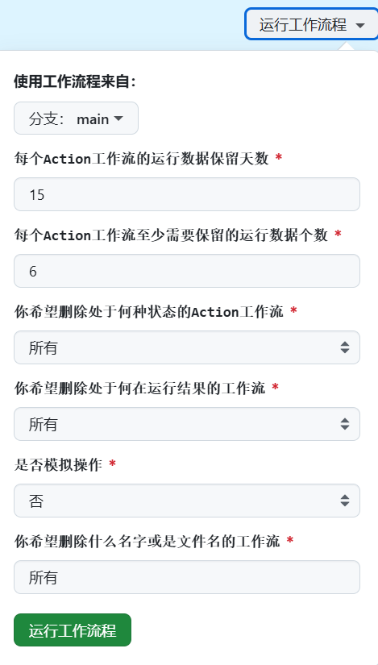
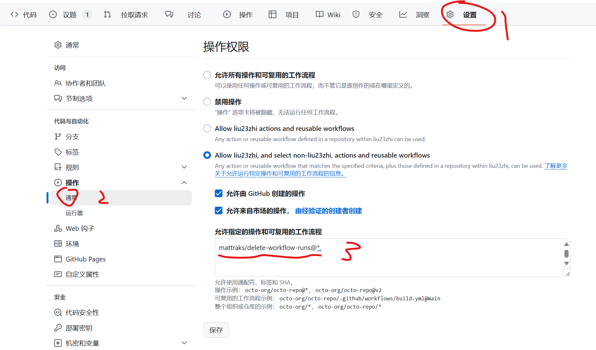
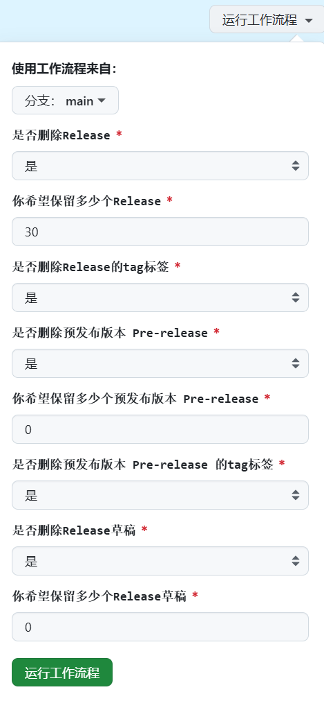

# 适用于广东天翼校园网的docker容器自动认证方案

## 主要维护者

**本项目并不提供任何反检测手段，如果需要，请移步至此[视频](https://b23.tv/XFgF5hd)**

**经过验证 <mark><ins>"[电子科技大学中山学院](https://www.zsc.edu.cn/)"</ins></mark> 可用！（掌声祝贺👏）**

**根据B站用户 [柒星隐天鱼](https://b23.tv/4cEgANf "柒星隐天鱼") 的反馈 <mark><ins>"[惠州工程职业学院](https://zs.hzevc.edu.cn/)"</ins></mark> 可用**

## 本项目基于Rsplwe大佬的项目 ☞[[传送门](https://github.com/Rsplwe/ESurfingDialer)] 和中国电信官方客户端（天翼校园），利用Github Action构建

**Phone通道版本占用手机认证通道进行网络认证**

**~~PC版本占用电脑认证通道进行网络认证~~**（PC通道版本已经炸了）

## Phone通道版本已经兼容amd64和arm64架构设备（除了ARM64 Windows）
## 随缘修复PC通道版本（最近不大可能会）

## 此项目利用了Github action自动拉取源码进行构建

可以尝试在使用本镜像的基础上，使用 **[watchtower](https://github.com/containrrr/watchtower "watchover")** 进行自动更新Docker镜像，确保该镜像为最新镜像。 
### 目前提供 ~~两种~~ 一种 Docker镜像；

1. ~~ESurfingDockerPc~~ **（炸了）**

此镜像占用电脑认证通道进行网络认证

2. ESurfingDockerPhone **（强烈推荐！！！）**

此镜像占用手机认证通道进行网络认证

### 此外还提供免docker直接运行版本（支持Linux和windows）

1. ESurfingDialer.zip **☞[[传送门](https://github.com/liu23zhi/ESurfingDialerDocker/releases/latest)]**
**此方案占用手机认证通道进行网络认证**

2. ~~ESurfingOffice.zip **☞[[传送门](https://github.com/liu23zhi/ESurfingDialerDocker/releases/latest)]**
基于中国电信官方客户端 编译而成   作者还没写
**此方案占用电脑认证通道进行网络认证**~~ **（都说炸了咯）**

**镜像会在编译时同时上传到Github Release和Docker Hub**

> **作者的话：因为电脑认证通道和手机认证通道并不冲突，所以理论上是可以实现一个账号双倍宽带速率的** | 🤣☞ **（理论上）**

# Docker版使用方法在此☞[[传送门]](/使用方法.md)

# 免Docker版使用方法尚未完成(Working)

# 暂未解决的问题

1. PC通道版本（至少现在不整）
2. ARM64 Windows无法兼容（无ARM64架构的JDK23）（最近会尝试兼容）

# 已解决的问题

1. openwrt搭配docker运行认证程序报No route to host或Network unreachable错误
>详细见[[解决方法](/No_route_to_host报错解决方法.md)]

# 无解问题

1. 运行大约十五小时后程序会出现timeout和socket_closed问题[[详情与曲线救国法](https://github.com/Rsplwe/ESurfingDialer/issues/40)]

# [[更新日志](/更新日志.md)]（24/11/25新增）

# 参考Action配置文件

根据 Github 帮助文档 https://docs.github.com/zh/rest/using-the-rest-api/rate-limits-for-the-rest-api?apiVersion=2022-11-28#primary-rate-limit-for-github_token-in-github-actions
Github Api速率限制为每个存储库每小时 1000 个请求

###### 1. 删除过于陈旧的Action

注意，这不是翻译的效果，此Action的用户输入已经完成汉化

复制.github\workflows\Delete_old_workflow_runs.yaml到需要的项目，并在
Settings->Actions->General->Actions permissions->Allow specified actions and reusable workflows
填入`mattraks/delete-workflow-runs@*,`

###### 2. 删除过于陈旧的Release

注意，这不是翻译的效果，此Action的用户输入已经完成汉化

复制.github\workflows\Dele_Old_Github_Releae.yaml到需要的项目，并在
Settings->Actions->General->Actions permissions->Allow specified actions and reusable workflows
填入`sgpublic/delete-release-action@*,`

